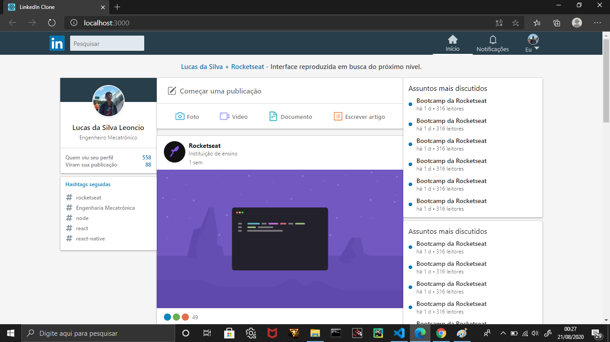
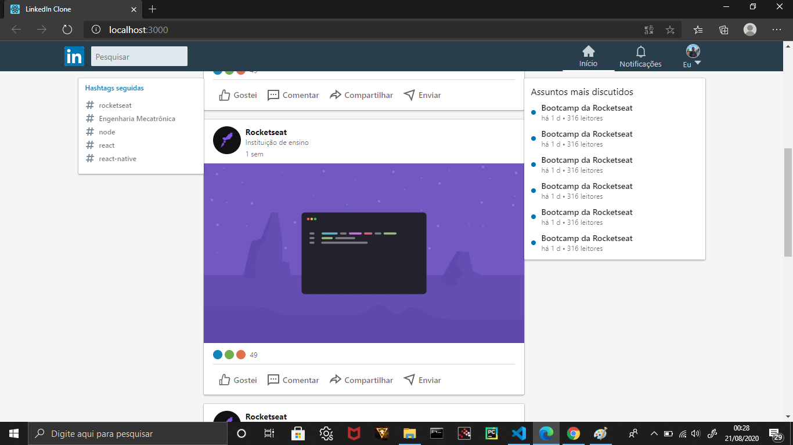
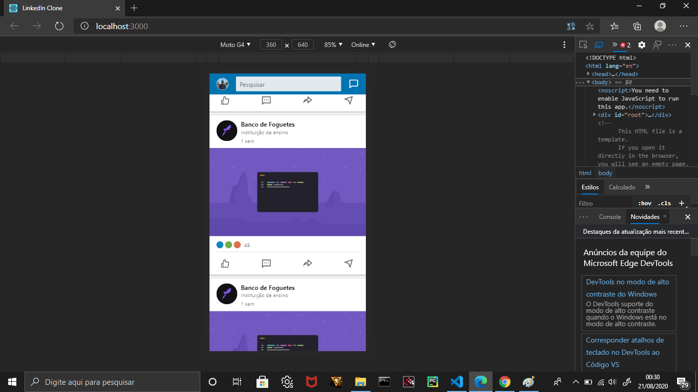
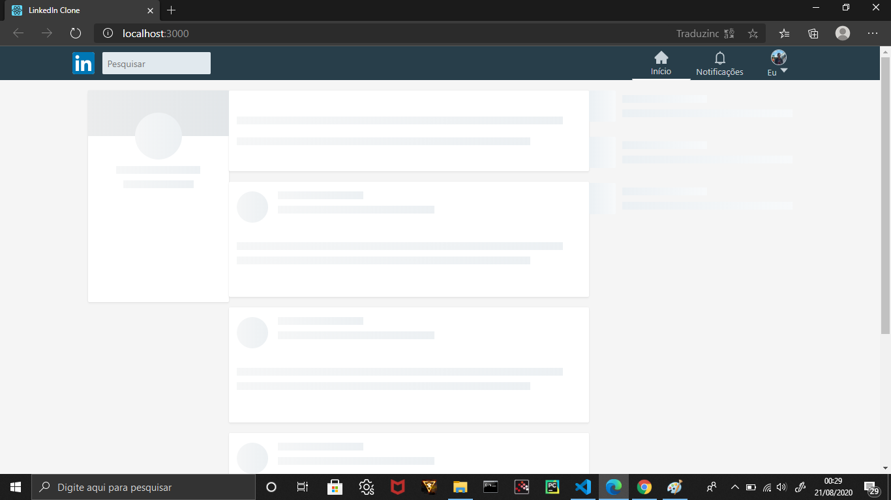
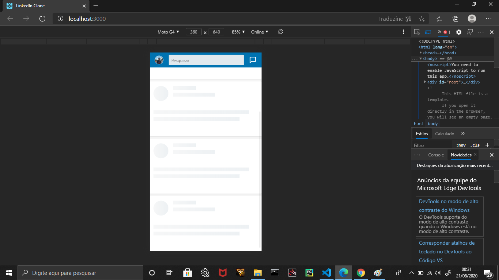

# Clone Linkedin :computer:

## Este projeto de clonagem foi baseado no vídeo Rocketseat. Esta plataforma foi selecionada porque tem um efeito de carregamento muito interessante. Efeito Shimmer é a exibição de um esqueleto da página na forma de animação ao invés de uma barra de processo ou barra de carregamento, este efeito é usado no linkedin.

### A imagem abaixo contém a home da clonagem. 

## Este projeto foi construído usando o conceito Mobile First que, basicamente, é feito primeiro a versão mobile e depois desktop.

## O conceito de componentização foi utilizado no projeto, que é visível na pasta de componentes. Este modelo arquitetônico torna mais eficiente a detecção de erros e torna o projeto mais organizado.

### A proxíma imagem contém o efeito shimmer (Desktop e Mobile).

## Todos os arquivos na pasta Shimmer dependem diretamente do arquivo Skeleton. Este arquivo contém a estilização do efeito Shimmer de cores a animações.

## Todo o projeto é responsivo. Esse projeto foi baseado no vídeo da Rocketseat. Next_Level.
